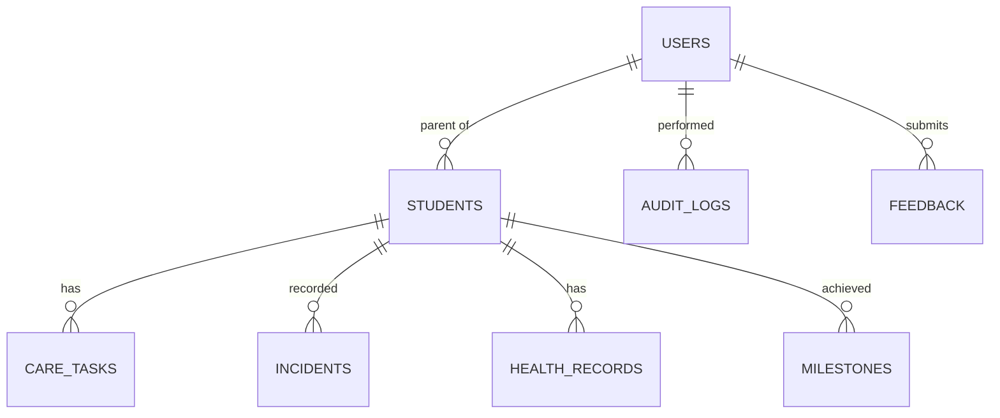

# KiddoZ Relational Database Schema (MySQL)

This project has been migrated to **MySQL** to satisfy DBMS Lab requirements. The schema follows relational best practices, including normalization, primary keys, and foreign key constraints.

## ER Diagram (Conceptual)


## Primary Tables

### 1. `Users`
Stores authentication and profile data for parents, staff, and admins.
- `id` (UUID/Int, PK)
- `name`, `email`, `password` (Hashed)
- `role` (ENUM: 'admin', 'staff', 'parent', 'nurse', 'nanny')

### 2. `Students`
Core entity representing children enrolled in the system.
- `id` (PK)
- `parentId` (FK -> Users.id)
- `name`, `dob`, `gender`
- `plan` (FK -> Plans)
- `attendance` (Status)

### 3. `CareTasks`
Scheduled daily activities for students (Relational replacement for NoSQL tasks).
- `id` (PK)
- `studentId` (FK -> Students.id)
- `type`, `scheduledTime`, `priority`
- `status` (Pending/Completed)

### 4. `HealthRecords`
Medical history and document logs.
- `id` (PK)
- `studentId` (FK -> Students.id)
- `fileName`, `fileSize`, `type`
- `uploadedBy` (Staff Email)

## Example SQL Queries (For Lab Report)

### 1. Complex JOIN: Get all pending tasks for a specific parent's children
```sql
SELECT s.name AS child_name, ct.type, ct.scheduledTime
FROM Students s
JOIN CareTasks ct ON s.id = ct.studentId
WHERE s.parentId = 'user-123' AND ct.status = 'Pending'
ORDER BY ct.scheduledTime ASC;
```

### 2. Aggregate Function: Count students by enrollment plan
```sql
SELECT plan, COUNT(*) as student_count
FROM Students
GROUP BY plan;
```

### 3. Subquery: Find parents who have more than 2 children enrolled
```sql
SELECT name, email 
FROM Users 
WHERE id IN (
    SELECT parentId 
    FROM Students 
    GROUP BY parentId 
    HAVING COUNT(*) > 2
);
```

## DBMS Features Utilized
1. **Relational Constraints**: Use of `ON DELETE CASCADE` for child records when a parent or student is removed.
2. **ACID Transactions**: Implemented via Sequelize transactions for critical operations like enrollment (creating User + Student + Initial Billing).
3. **Normalization**: Data is split across 23 tables to ensure 3NF compliance (e.g., separating authentication from student data and activity logs).
